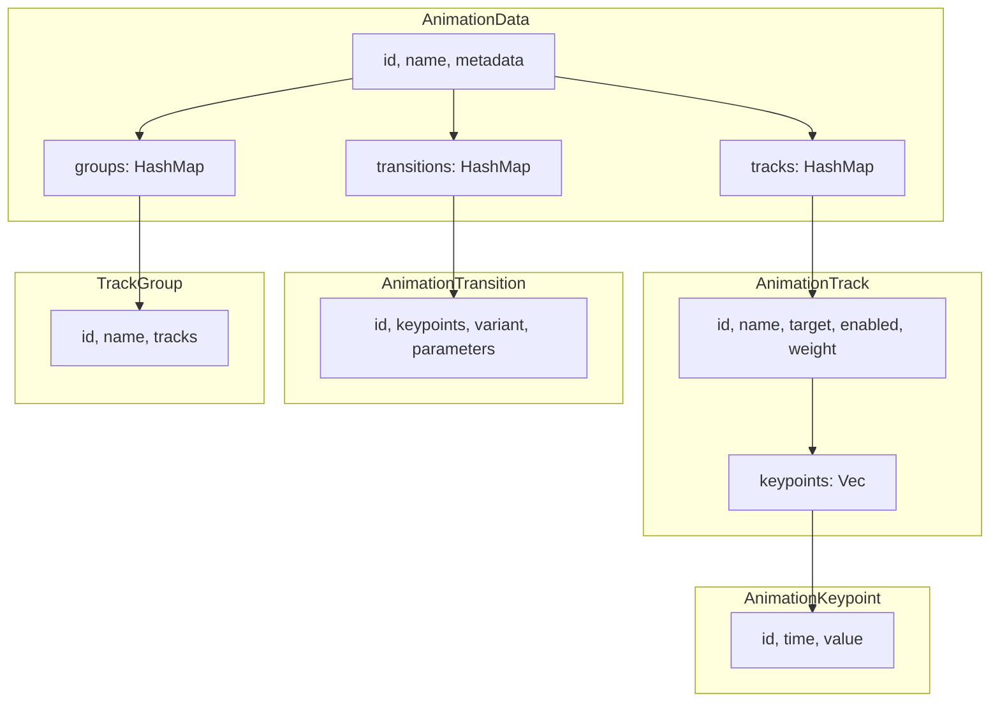
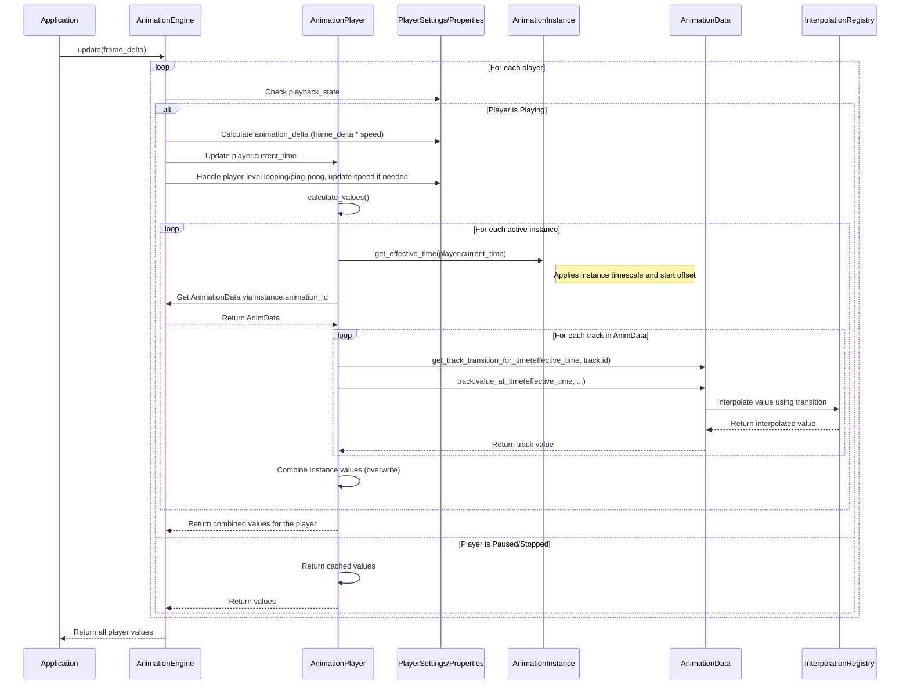

# Animation Player Architecture

This document provides a detailed overview of the animation player architecture, focusing on the `AnimationEngine`, `AnimationPlayer`, and `AnimationInstance` components and their relationships.

## Overview

The animation system follows a hierarchical architecture:

1.  **`AnimationEngine`**: The top-level container that manages all resources, including animation data, players, and the interpolation registry. It drives the global update loop.
2.  **`AnimationPlayer`**: A manager for a collection of animations that should be played back together. It maintains a timeline (`current_time`) and orchestrates multiple `AnimationInstance`s.
3.  **`AnimationInstance`**: Represents a single, active animation with its own unique settings (like `timescale`, `looping`, `start_time`). It is responsible for calculating its effective time based on the parent player's time.

This design allows for complex, multi-layered animations where different animation clips can be played on the same target with independent timing, looping, and blending behaviors.

## Core Architecture

### Animation Data Model

The foundation of the system is a flexible animation data model.

-   **`AnimationData`**: The main container for an animation clip. It holds tracks, transitions, and groups.
-   **`AnimationTrack`**: A sequence of keypoints targeting a specific property (e.g., `transform.position.x`).
-   **`AnimationKeypoint`**: A point in time with a specific value.
-   **`AnimationTransition`**: Defines the interpolation method (e.g., `Linear`, `Cubic`, `Bezier`) between two keypoints.
-   **`TrackGroup`**: An organizational tool to group related tracks.

## Animation Update Flow

The animation update process is driven by the `AnimationEngine`'s `update` method, which is called on every frame.

## Key Concepts Explained

### AnimationEngine Responsibilities

-   **Resource Management**: Loads, stores, and provides access to `AnimationData` via `load_animation_data`. Manages the shared `InterpolationRegistry`.
-   **Player Lifecycle**: Creates (`create_player`) and destroys (`remove_player`) `AnimationPlayer` instances.
-   **State Management**: Tracks `PlayerSettings` (user controlled) and `PlayerState` (runtime state) for each player.
-   **Global Playback Control**: Provides top-level methods to `play_player`, `pause_player`, `stop_player`, and `seek_player`.
-   **Update Loop**: Drives the entire animation system forward in time, iterating through players, updating their time based on their state, and collecting the final animation values.

### AnimationPlayer Responsibilities

-   **Instance Management**: Manages a collection of `AnimationInstance`s using `add_instance` and `remove_instance`. A single player can orchestrate multiple animations simultaneously.
-   **Timekeeping**: Maintains its own `current_time`, which acts as the master clock for all its instances.
-   **Value Calculation**: Its core task is to implement `calculate_values`, which iterates through all active instances, triggers their value calculation, and combines the results into a final output map.
-   **Metrics**: Tracks performance metrics like frames rendered and interpolations performed.

### AnimationInstance Responsibilities

-   **Individual Animation State**: Represents a single playing animation clip. It links to `AnimationData` via its `animation_id`.
-   **Behavior Definition**: `AnimationInstanceSettings` define its unique behavior:
    -   `timescale`: Controls the playback speed relative to the player.
    -   `instance_start_time`: Defines an offset on the player's timeline, allowing for staggered animations.
-   **Effective Time Calculation**: Its most critical role is to translate the player's `current_time` into its own local time (`get_effective_time`), applying its settings.
### Value Calculation Flow

1.  **Engine Update**: The `update` method is called with the frame's delta time.
2.  **Player Iteration**: The engine iterates through each `AnimationPlayer`.
3.  **State Check**: It checks the `PlayerState`. If not `Playing`, it may return cached values and skip the update.
4.  **Player Time Update**: The engine calculates the time change based on `frame_delta` and the player's `speed`. It updates the player's `current_time` and handles player-level looping or ping-pong by reversing speed or wrapping time.
5.  **Instance Processing**: The player's `calculate_values` method is called. It iterates through its active `AnimationInstance`s.
6.  **Effective Time**: For each instance, it calculates the *effective time* by applying the instance's start offset, timescale, and looping rules to the player's `current_time`.
7.  **Interpolation**: It retrieves the corresponding `AnimationData` and, for each track, calls `track.value_at_time()` with the effective time. This function finds the correct keypoints and transition, and uses the `InterpolationRegistry` to compute the final, interpolated `Value`.
8.  **Value Combination**: The values from all tracks across all instances are combined. Currently, this is a simple overwrite, with later tracks/instances overriding earlier ones. Future work will introduce blending.
9.  **Return Values**: The final map of `[track_target -> Value]` is returned up to the engine.

