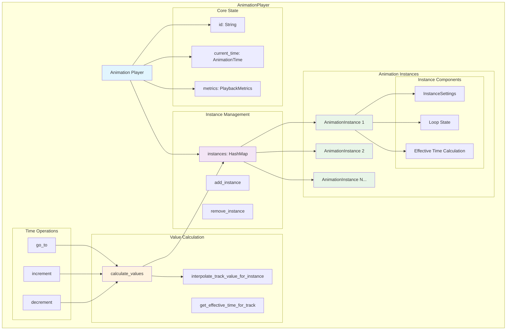
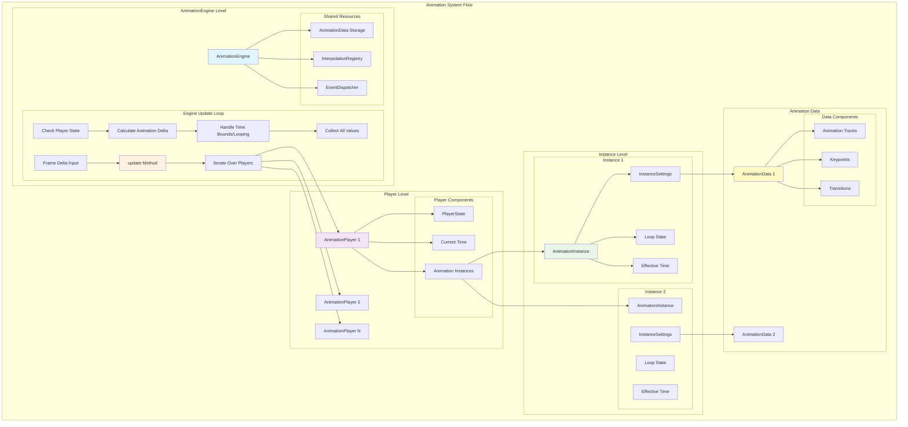
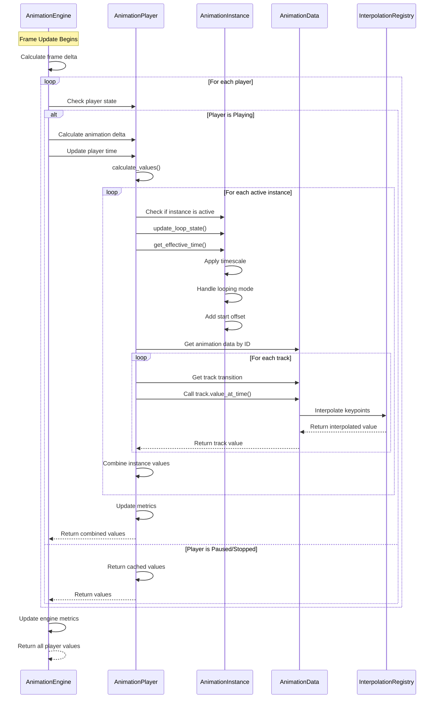

# Animation Player Architecture

This document provides a detailed overview of the animation player architecture, focusing on the AnimationEngine and AnimationPlayer components and their relationship in managing individual animations.

## Overview

The animation system follows a hierarchical architecture where the **AnimationEngine** manages multiple **AnimationPlayers**, and each player manages multiple **AnimationInstances**. This design allows for complex multi-layered animations with independent timing, looping, and blending capabilities.

## AnimationPlayer Architecture

## Engine-Player Relationship and Animation Management

## Individual Animation Update Flow

## Key Concepts

### AnimationEngine Responsibilities

- **Player Lifecycle Management**: Creates, manages, and destroys animation players
- **Resource Management**: Loads and caches animation data, manages interpolation registry
- **Global Playback Control**: Provides play/pause/stop/seek operations for individual players
- **Performance Monitoring**: Tracks engine-wide metrics and performance
- **Event Coordination**: Manages event dispatching across the system

### AnimationPlayer Responsibilities

- **Instance Management**: Manages multiple animation instances with different settings
- **Time Coordination**: Maintains current playback time and handles time-based operations
- **Value Calculation**: Combines values from all active instances
- **Player-level Metrics**: Tracks performance metrics for this specific player

### AnimationInstance Responsibilities

- **Individual Animation Control**: Manages settings for a specific animation (timescale, looping, offsets)
- **Time Mapping**: Converts player time to effective animation time
- **Loop State Management**: Handles loop counting and ping-pong direction
- **Animation Data Reference**: Links to specific animation data by ID

### Value Calculation Flow

1. **Engine Update**: Called with frame delta time
2. **Player Iteration**: Engine iterates through all players
3. **State Check**: Check if player is in Playing state
4. **Time Calculation**: Apply speed multiplier and calculate new time
5. **Bounds Handling**: Handle looping/ping-pong at player level
6. **Instance Processing**: For each active instance:
   - Check if instance should be active at current time
   - Update instance loop state
   - Calculate effective time (apply timescale, handle instance-level looping, add offset)
   - Interpolate values from animation data
7. **Value Combination**: Combine values from all instances (currently simple overwrite, future: blending)
8. **Metrics Update**: Update player and engine metrics

### Multi-layer Animation Support

The architecture supports complex multi-layer animations through:

- **Multiple Instances per Player**: Each instance can reference different animation data
- **Independent Timing**: Each instance has its own timescale, start time, and duration
- **Flexible Looping**: Per-instance loop modes (Once, Loop, PingPong)
- **Offset Support**: Start offset allows instances to begin from any point in their animation
- **Blending Ready**: Architecture prepared for future blending between instances

This design enables scenarios like:

- Playing multiple animations simultaneously on the same object
- Layering animations with different timing characteristics
- Creating complex composite animations from simpler building blocks
- Managing large numbers of independent animations efficiently
