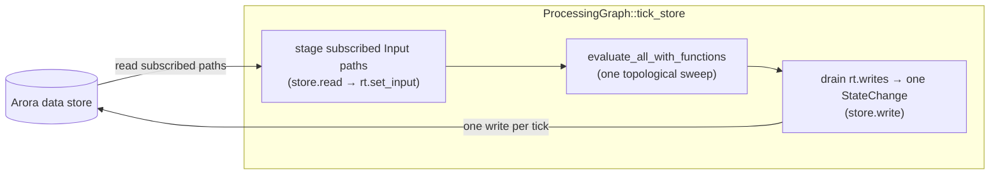

# Vizij's node graph as an Arora behavior interpreter

Vizij's node graph is a **behavior interpreter** in the Arora sense. Read Arora's **[how a behavior interpreter works](https://github.com/semio-ai/arora-sdk/blob/main/crates/arora-behavior/docs/interpreter-workflow.md)** first — it defines the `BehaviorInterpreter` contract (the `tick` / `apply` / `load` lifecycle, the `BehaviorContext` store, timing as built-in store keys) that this page assumes. Here we cover what is *specific* to the node graph, and draw the parallel with the other reference interpreter, [`arora-behavior-tree`](https://github.com/semio-ai/arora-sdk/blob/main/crates/arora-behavior-tree/docs/nodes.md).

The interpreter type is [`ProcessingGraph`](../src/lib.rs#L75), which implements `arora_behavior::BehaviorInterpreter` ([`lib.rs:176`](../src/lib.rs#L176)). The evaluation engine underneath it is the separate, host-agnostic [`vizij-graph-core`](../../../node-graph/vizij-graph-core/) crate. Vizij and Arora share **one runtime value type** (`vizij_api_core::Value` *is* `arora_types::value::Value`), so values cross the store and call boundaries with no conversion ([`vizij-arora/src/lib.rs:1-13`](../../vizij-arora/src/lib.rs#L1-L13)).

## Lifecycle mapping

The interpreter's spine is `tick_store` ([`lib.rs:135-177`](../src/lib.rs#L135-L177)), which `tick` calls each frame:

| Interpreter lifecycle | Vizij node graph |
|---|---|
| load | `load` retains the new structural graph and re-lowers it to the spec on the next tick, keeping the graph runtime **warm** — surviving nodes retain their integration state (springs/dampers/URDF) and the graph clock stays continuous; a recompose never rebuilds the device ([`load`, `lib.rs`](../src/lib.rs)) |
| time update | `dt` is read from the built-in `arora/dt` store key and advances the graph clock (`rt.t += dt`) ([`built_in_dt_seconds`, `lib.rs`](../src/lib.rs)) |
| tick | if edited, re-lower the retained graph, then stage subscribed inputs → `evaluate_all` → flush outputs; **always returns `BehaviorStatus::Running`** ([`lib.rs`](../src/lib.rs)) |
| graph update | `apply(GraphDiff)` edits the retained structural graph and re-lowers on the next tick — an unedited node keeps its id, so its runtime state survives (see [Editing](#editing-structural-load-or-graphdiff)) |

The single most important contrast with a behavior tree: **a node graph is continuous.** It reports `Running` every frame ([`lib.rs:185`](../src/lib.rs#L185)), whereas a tree runs to a terminal status and reports `Done`. Timing is data for both — the graph reads `arora/dt` exactly as the tree does.

## What a node is in Vizij

A node graph is **dataflow**, not control flow. A node is one [`NodeSpec { id, kind, params, output_shapes, input_defaults }`](../../../node-graph/vizij-graph-core/src/types.rs#L319-L335); edges ([`EdgeSpec`](../../../node-graph/vizij-graph-core/src/types.rs#L423-L433)) wire a named **output port** of one node to a named **input port** of another, with an optional field/index selector. `NodeType` is a large value-producing vocabulary — arithmetic, trig, time/oscillators, springs/damping, logic, vectors, IK/FK, records — plus the three that form the Arora seam ([`types.rs:151-159`](../../../node-graph/vizij-graph-core/src/types.rs#L151-L159)): `Input` (reads a staged host value by path), `Output` (writes a value to a host path sink), and `ExternalFunction` (invokes a module by opaque id).

Each frame the engine walks all nodes in cached topological order ([`evaluate_all_inner`, `eval/mod.rs:66-125`](../../../node-graph/vizij-graph-core/src/eval/mod.rs#L66-L125)) and dispatches each on its `kind` ([`evaluate_kind_inner`, `eval_node.rs:286-391`](../../../node-graph/vizij-graph-core/src/eval/eval_node.rs#L286-L391)). A node reads named input ports and writes named output ports; the value on a port is a [`PortValue { value: Value, shape: Shape }`](../../../node-graph/vizij-graph-core/src/eval/value_layout.rs#L17-L20).

### Vizij node vs. behavior-tree node

| | [arora-behavior-tree node](https://github.com/semio-ai/arora-sdk/blob/main/crates/arora-behavior-tree/docs/nodes.md) | Vizij graph node |
|---|---|---|
| A tick produces | a `Status` — `Success` / `Failure` / `Running` | `PortValue`s on its output ports (no status) |
| An edge means | an argument/child edge (control flow) — a parent ticks children and reacts to status | a dataflow edge — an output value feeds an input port |
| Traversal | recursive tick driven by control nodes (seq/fallback) | one topological sweep, every node every frame |
| Termination | runs to a terminal status → interpreter reports `Done` | continuous → interpreter reports `Running` forever |

This duality is exactly what the shared behavior-graph model anticipates: it "does not know how any particular interpreter walks the links — the behavior tree reads them as argument/child edges; a node graph reads them as dataflow" ([`arora-behavior/src/graph.rs:12-16`](https://github.com/semio-ai/arora-sdk/blob/main/crates/arora-behavior/src/graph.rs#L12-L16)).

## How nodes touch the data store

The graph does **not** touch the store during node evaluation — it *stages in* and *flushes out*, both inside `tick_store`:



- **Read (store → graph):** each subscribed input path (the graph's `Input` nodes, [`input_paths`, `lib.rs:98-104`](../src/lib.rs#L98-L104)) is read from the store and staged into the runtime ([`lib.rs:142-152`](../src/lib.rs#L142-L152)); an `Input` node then consumes it during evaluation ([`eval_input_node`, `eval_node.rs:2205`](../../../node-graph/vizij-graph-core/src/eval/eval_node.rs#L2205)).
- **Write (graph → store):** only sink `Output` nodes emit writes; they are collected during the sweep and drained into a **single `StateChange`** written once per tick ([`lib.rs:166-175`](../src/lib.rs#L166-L175)). A path-less `Output` with `key_field`/`value_field` expands an array-of-records into one write per record ([`eval_node.rs:244-284`](../../../node-graph/vizij-graph-core/src/eval/eval_node.rs#L244-L284)).

This is the same store seam a behavior tree uses (read inputs, write outputs), but staged at the tick boundary rather than per-node — where the tree binds each `{var}` to a store `Slot` and reads/writes it mid-tick, the graph batches a read pass before and a write pass after evaluation. Round-trip test: [`graph_reads_and_writes_the_arora_store`](../src/lib.rs#L269-L293).

## How nodes call modules (and animation)

A node reaches a module through an `ExternalFunction` node, which carries only a stable **function UUID** plus opaque arg-key handles ([`node_function.rs:1-8`](../../../node-graph/vizij-graph-core/src/eval/node_function.rs#L1-L8)). The engine calls the host `NodeFunctions` trait ([`node_function.rs:32-35`](../../../node-graph/vizij-graph-core/src/eval/node_function.rs#L32-L35)):

```mermaid
flowchart LR
  extnode["ExternalFunction node<br/>(function UUID + args)"] --> hostcall["NodeFunctions::call(function, args)"]
  hostcall --> adapter["CallBridgeFunctions<br/>(function → module map)"]
  adapter --> call["CallBridge::arora_call<br/>Call { module_id, id, args }"]
  call --> engine["Arora engine module<br/>(e.g. animation)"]
  engine -- "result.ret" --> extnode
```

The Arora binding of that host is [`CallBridgeFunctions`](../src/lib.rs#L47-L76): it looks up the `function → module` id ("the engine routes a `Call` by its `module_id`"), builds `Call { module_id, id: function, args }` from the opaque UUIDs, dispatches through the `CallBridge` the interpreter got in its `BehaviorContext`, and returns `result.ret` ([`eval_external_function`, `eval_node.rs:393-419`](../../../node-graph/vizij-graph-core/src/eval/eval_node.rs#L393-L419)). **Animation** is one such module: `vizij-animation-core` packaged as a standalone Arora wasm module ([`vizij-animation-module/src/lib.rs:1-31`](../../vizij-animation-module/src/lib.rs#L1-L31)), reached the same way as any other — an `ExternalFunction` node whose function/module UUIDs point at it.

This is the UUID-keyed analogue of the behavior tree's module dispatch (a non-built-in node id resolved through the engine): both go through `CallBridge::arora_call`; the graph routes by an explicit `function → module` map, the tree by a `function_index`. Dispatch test: [`external_function_dispatches_through_host_and_sets_output`](../../../node-graph/vizij-graph-core/src/eval/external_function_tests.rs#L75-L107).

## Editing: structural load or GraphDiff

`ProcessingGraph` edits exactly like the behavior tree — a whole-graph `load` or an incremental `apply(GraphDiff)` — because it holds the shared model's **structural** graph (one shared `Node` per Vizij node — see [`graph_codec`](../src/graph_codec.rs)) as its editable source of truth, and lowers it to the `vizij-graph-core` spec it evaluates (`graph_codec::decode`) on the next tick after a change. This is [VIZ-79](https://linear.app/semio-ai/issue/VIZ-79): the earlier opaque spec-carrier — the whole spec rode one node as a literal, and `GraphDiff` edition was rejected — is gone.

- **load** installs a new structural graph whole.
- **apply(GraphDiff)** adds/removes nodes and links on the retained graph. The wasm boundary takes a Vizij spec-level diff (`GraphSpecDiff`: `upsert_nodes` / `remove_nodes` / `upsert_edges` / `remove_edges`) and translates it to an `arora_behavior::GraphDiff` with the *same* per-node/per-edge encoders as `encode` (`graph_codec::spec_diff_to_graph_diff`); it reaches the interpreter as the engine's EDIT call. An upserted node is removed then re-added, so every edge incident to it rides along in `upsert_edges`.

Both keep the graph runtime **warm**: neither resets the `GraphRuntime`, so nodes that survive keep their integration state (springs/dampers/URDF chains) and the graph clock stays continuous — a program starting or stopping restarts no stateful node, and an edit restarts only what it touched (an unedited node keeps its id, so `evaluate_all` keeps its state). The version is carried forward before re-caching so the version-keyed `PlanCache` rebuilds for the new topology (a fresh decode restarts at version 0, which would otherwise serve the previous plan). Tests: in-place swap ([`load_swaps_the_graph_in_place`](../src/lib.rs)), incremental edit ([`apply_edits_the_running_graph`](../src/lib.rs)), warm continuity ([`load_keeps_the_graph_runtime_warm`](../src/lib.rs)).

(Structural changes *within* a running spec — reconnecting edges, adding nodes — are also absorbed by the engine's `PlanCache`, invalidated by the version bump; that is graph-core's own concern, separate from the Arora edit path.)

## Source map

| Concept | File |
|---|---|
| `ProcessingGraph` (the interpreter), `tick_store`, `CallBridgeFunctions` | [`crates/interop/vizij-arora-behavior/src/lib.rs`](../src/lib.rs) |
| Structural encoding (load/edit), `GraphSpecDiff` → `GraphDiff` | [`crates/interop/vizij-arora-behavior/src/graph_codec.rs`](../src/graph_codec.rs) |
| Graph spec / node / edge types | [`crates/node-graph/vizij-graph-core/src/types.rs`](../../../node-graph/vizij-graph-core/src/types.rs) |
| Per-node evaluation dispatch | [`crates/node-graph/vizij-graph-core/src/eval/eval_node.rs`](../../../node-graph/vizij-graph-core/src/eval/eval_node.rs) |
| `NodeFunctions` host trait (module calls) | [`crates/node-graph/vizij-graph-core/src/eval/node_function.rs`](../../../node-graph/vizij-graph-core/src/eval/node_function.rs) |
| Animation packaged as an Arora module | [`crates/interop/vizij-animation-module/src/lib.rs`](../../vizij-animation-module/src/lib.rs) |
| The Arora interpreter contract this satisfies | [arora-behavior interpreter workflow](https://github.com/semio-ai/arora-sdk/blob/main/crates/arora-behavior/docs/interpreter-workflow.md) |
| The other reference interpreter (parallels drawn here) | [arora-behavior-tree nodes](https://github.com/semio-ai/arora-sdk/blob/main/crates/arora-behavior-tree/docs/nodes.md) |

Tests worth reading: store round-trip ([`lib.rs:269-293`](../src/lib.rs#L269-L293)), in-place graph swap ([`lib.rs:297-340`](../src/lib.rs#L297-L340)), external-function dispatch ([`external_function_tests.rs:75-107`](../../../node-graph/vizij-graph-core/src/eval/external_function_tests.rs#L75-L107)), and end-to-end Input→selector→math→Output dataflow ([`eval/tests.rs:1673-1780`](../../../node-graph/vizij-graph-core/src/eval/tests.rs#L1673-L1780)).
